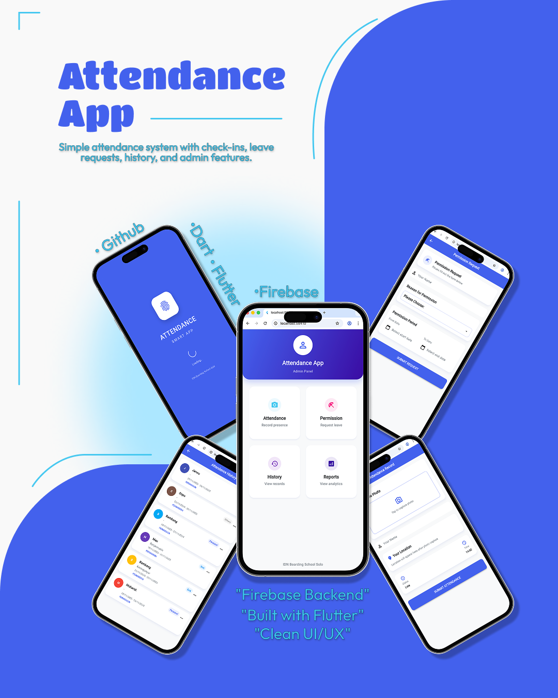

## 📱 Attendance App

A simple attendance application built with Flutter, designed for recording daily check-ins, leave requests, and attendance history with a clean and modern UI.

### ✨ Key Features
- Daily check-in & attendance tracking
- Leave / permission requests
- Attendance history
- Admin panel
- Firebase backend integration

### 🛠 Tech Stack
- Flutter (Dart)
- Firebase Authentication
- Cloud Firestore
